# Recruitement App
> DevOps Core Fundamental Project 
#### Objective: The personal objectives listed below relate directly to the skills listed in the **[ SFIA 7 framework ](https://www.sfia-online.org/en/framework/sfia-7)**
 To create a fully functional CRUD application with utilisation of supporting tools,methodologies and technologies. To work  efficiently by responding to change when need be. To work with DevOps mindesetand by following the four main values and Devolping my Core skills and improve value of my skillset.
 
--- 

### Materials:
1. [ Recruitment Website ](https://34.89.105.159:5000)
2. [ presentation ](https://docs.google.com/presentation/d/1t09if4lU1a9x9wSj-CRnNaoeSMQIHuru3_VedxZLW-g/edit#slide=id.p)

---

### Contents
1. [Execuitve Summary & Critical Review](#execuitve-summary-&-critical-review)
    1. Aim  
    1. My Method
    1. Summary

2. [Architecture](#Architecture) 
    1. Database Structure - CRD & SQL Tables
    1. CI Pipleline

3. [Project Tracking](#Project-Tracking)

4. [Testing](#Testing)

5. [Front-End Design Walk Through](#Front-End-Desing-Walk-Through)

6. [Risk Assessment](#Risk-Assessment)]

6. [Conclusion](#conclusion)
    1. Identified Issues
    1. Future Improvments
7. [Reference](#Reference)
8. [license](#Licence)

---

## Execuitve Summary & Critical Review
### Aim
The Aim of this Project was to succefully Create an Application Which gives the the user the ability to Create, Read, Update and delete within a Flask Website. 

Bespoke requirements for myself was include a Project Tracking tool, create a databses that shares Relations whitin its tables, provide documentation of all phases, build test suits and intergrate my code into some type of verison control sytsem built by a CI server and depolyed through a virtual machine using a cloud server .

the creation of a crud Application using a micro framework like Flask was great as is provides a huge libary of compents that could be customisation to the speciffication of this Recuitment App. some of which included Flask-Forms which helped with the create functionality of the application and SQLAalchemy which helped me connect my python code to the Recuitment Database. 

## My Method
### Recuitment APP
the Recruitemnt application is a functional display of recuitment in the virual world. a " "Client" User is able to create a job Post by fillng out a Form and upon submisson that form will be posted on the home page of the Website. the update and delted function can also be found of the home page which will alter or remove JobPost from the database. Similaly a 'job seeker' user can click on any job posted on the home page of the webiste to complete a form and apply for that specifif job. 

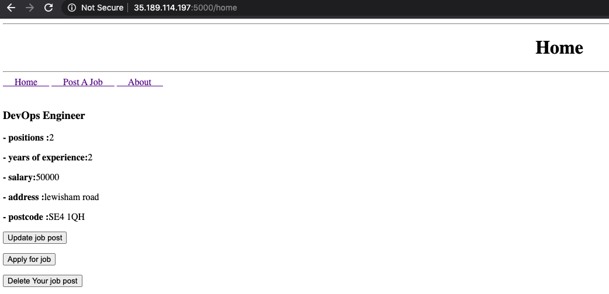 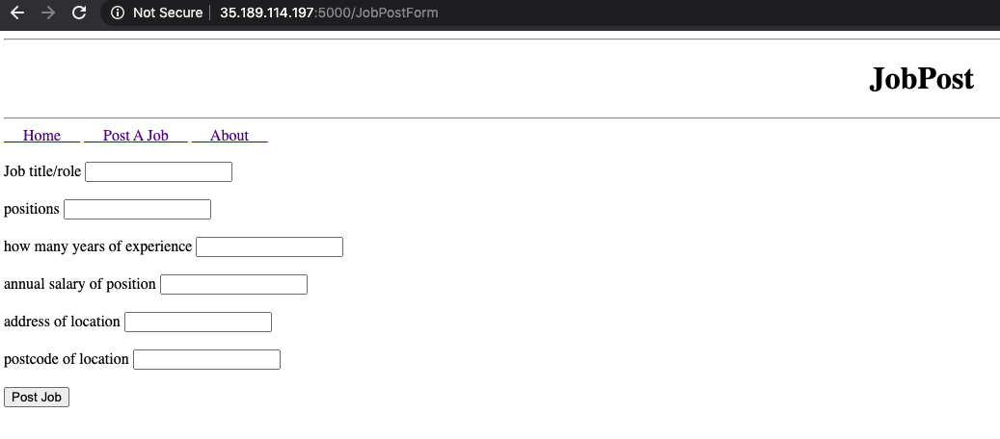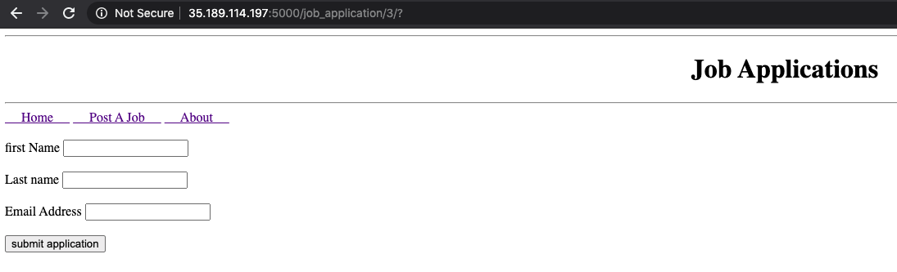

the application itself itself is built and run through jenkins, which with a specif config works as a system desrvice.

### Summary 

in summary a succeful Front-end and back-end CRUD application was created with a 88% test coverage. project tracking, testing and CI tools was used with the mindset of a DevOps engineer inorder to work effeicnt and focus on contiouse deployment. Along with this risks were identified and a risk assement was created to take precaution whilst completing this project. Some issues and improvments have been stated in the conclusiion to the project.

[Back to the Top](#Recruitement-App)

---

## Architecture 

### DataBase Structure

Isluatrated below is four tables of which i planned to include in my project within one Database. Although only Two was implemented the relationship between each table can be seen using the relevent connections and foreign/primary Keys. 

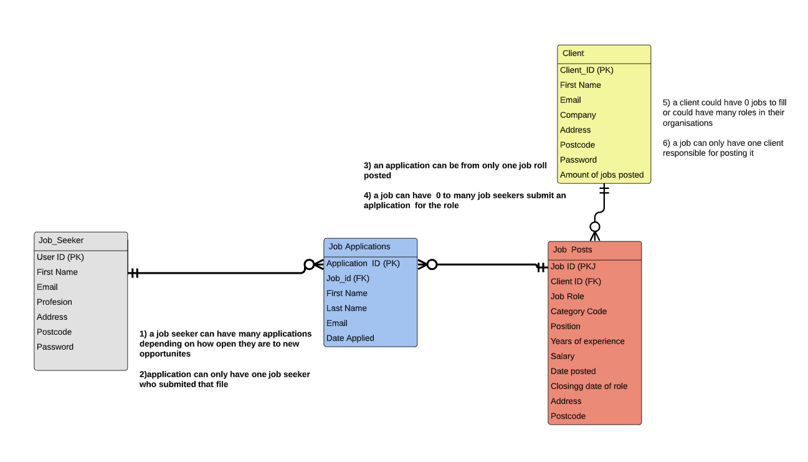

like stated aboove, overall only two tables was implemented "JobAplications" and "JobPosts".  A jobPost can have 0 to many Apllications for it, and a application can be from only one job roll posted. the application table depends on a Job to be Posted and makes use of the Primary Key "job_id" iorder for the user to identuify which job they are applying for. Modelled below is the specification Created in Google SQL.

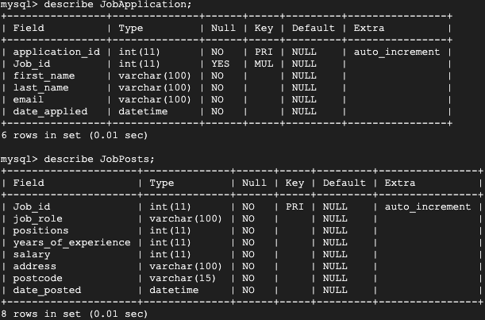

Above were the two tables impimented in this application. the Tpe Collumb is set specifially for each varible in the table. the Jobid seen in the JobPosts Table in the FOreign Key in the JobApllications table and is also auto incrimented. all varibles in the dable must conatin data to be submited other a erros will be displayed. for example in the JobPosts table the salary cant contain more than 11 intergers or the address cant contain more than 100 charecters. below is what the error would look like on the website otherwise click [here](application/routes.py) to see the source code.

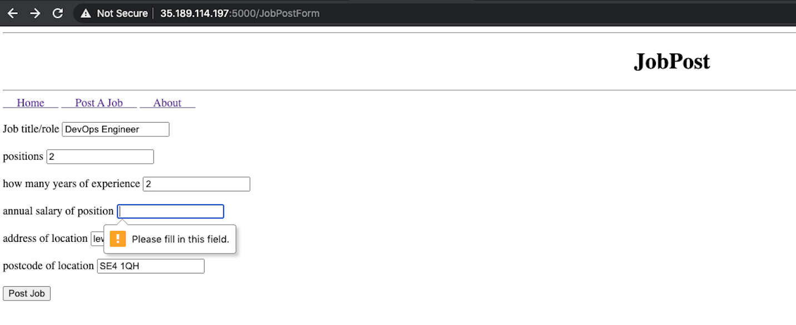

### CIP Piplie
 

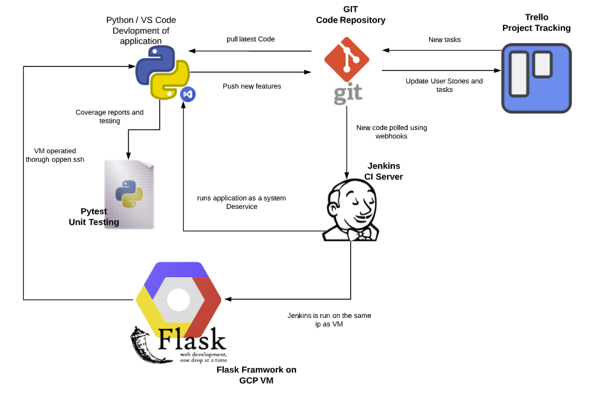

to elaberate on some of the technologis used in the CI piple is as follows:
* GCP - to create the virtual enviorment and also set up the foundation of our Databases using MySQL.
* VS Code/Python - is an interpreter which allows better visualisation when building the flask application using python, in comparison to coding using google ssh. 
* Trello board to keep track of the project progress.
* GitHub: allows the source code to be stored and also webhooks are created which tigger the ci server to build//run the application.
* PyTest: to test the application and produce a covrage report. 

[Back to the Top](#Recruitement-App)

---
## Project Tracking

This board was used to highlight the userstories/tasks and keep the devopment of the project on track. the Moscow principle was aapplied by color cooding what must be done (red), should be done (green), could be done (blue) and would be done (yellow). following a DevOps mindset and agile methology the User Stories can be seen to the far left. from this the sprint and backlog was created and sorted in terms of pririty using th emoscow princple. all task with a red lable must have been complete for the CRUD Application to be succseful. below is the progress of the trello board half way through the project.

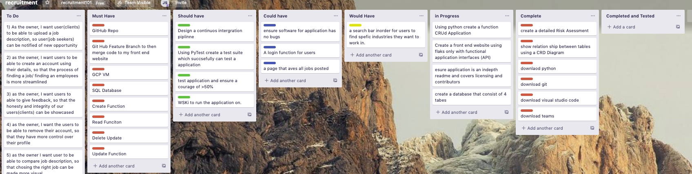

As you can see most of the should haves, have not been coplete nor tested. thoughout the project more task was inputed and the completed version can be seen below. 

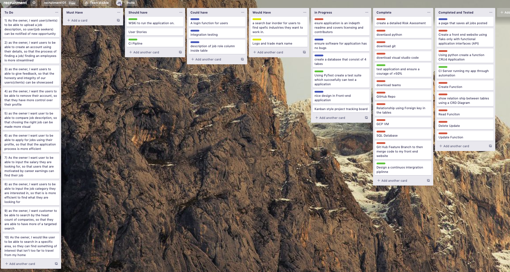

in conclusion all should have had been met. unfortuantly some task were still in progress like testing and may take some more time to complete. 

[Back to the Top](#Recruitement-App)

---
## Testing

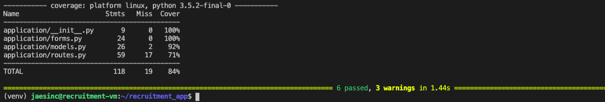

Illustrated above is pytests coverage results for the application. the main priority is that if a function is executed the output should be know which is why all the major CRUD Functions had been tested. All forms created was 100% tested, the models file which contains the structure of the databases was 92% test and finally the routs.py file which is where all function were defined was 71% test. a total of 88% coverage was acheived and it was chosen that the priotity would be to test the CRUd Function and URL links so that at least data can be collected.

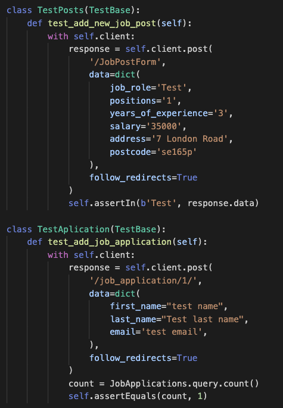

The create functions above was tested by the following:
* a user can create a job post and directed back to the home page when submitted. on the home page they should be able to visualise the post which had been created.
* a user can create an application for a job which is then stored in a database. 

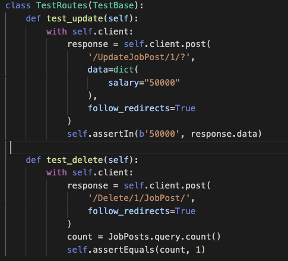

the update and delete functions above was tested by the following
* using the testbase setup, the delete function when executed whill remove an entry in the database. python will then count how much entry their are currently and if their is if the result is correct the test will have passed.
* the update function will change a varibe in the the defalt jobs created within the testbase setup. if that varible is now found pytest will have passed.

[Back to the Top](#Recruitement-App)

---

## Risk Assessment
The Risk asssesment below contains some of the possible risks when creating an application during this cohort. the likelyhood of the risk are scored using a color code and given a number. red be veryhigh risk, orange being high risk and yellow being moderatly low risk. An overall score for each risk can be found in the last columb.

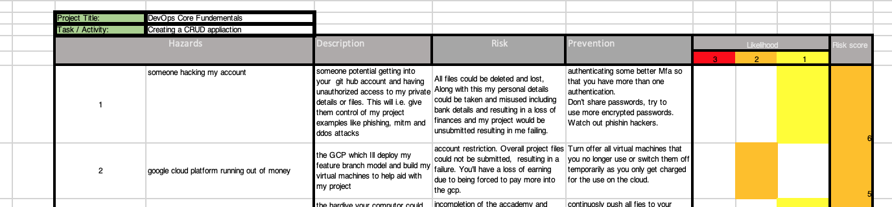

### Risk Assessment revisited

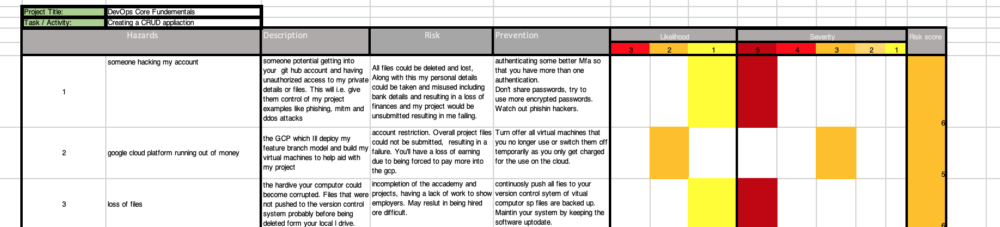

the risk assentment was updated thoruhgh out the project because of the exposure of new risk that could possibly occure. a columb was then added "Servirity of the risk to take into consideration how severe it the risk could impact your work. this paremtere was then included n the overall risk score. to view the whole risk assesment click [here](#Documents/RiskAssessment.xlsx) 

[Back to the Top](#Recruitement-App)

---

## Conclusion

In conclusion, i followed the reqiuirment that set on my KanBAn Bord and work with the MVP concept which resulted in a creating a succsful CRUD. Users are able to creat a Job and a Apllication, update a Job Post Delete a job Post and VIsualise/Read all Posts made on the homepage. risks were identified along with clear documentation of the architectur in this application. Using Visual Code and python to build my application was very efficent as python is very easy to understand at a beginers level and Vs code allowed me to acces my work more easy than using the GCP SSH. i now have a clear understanding how to use Flask, code in python and automate the process using a CI server for system deservice.

### Identified Issues
Due to a succseful CRUD application thier were not many issues established. however due tot he tesing coverage being only 88%, perhaps some issuse were not seen. Regarldess some of the main issues faced whilst creating this crud application are as follows:

* Gunicorn unable to work with jenkins. this was a result of jenkins being unable to run the gunicorn command to run my app. one possible sollution to this could be to create a new VM then set up jenkins again. 

### Future Improvmments
in conclsusion to the identified issuses, the improvment to be made to the application would be as follows:
* Run my app thoruhg a WSGI, to give the sevrer a set of rules to abide by inorder for the server to be compatioable with any framework that use it. this will allow my app to run on a production deployment server. over all if the traffic coming into my website faces some erros using the aplication, a internal servor error will be dsiplayed rather than the problem thats going on in the back end of my application. this could be done by instaling a program like Gunicorn or Django.
* Create a Login funtion so that the functionalatity of my webiste is enhanced. with this function i would have be able to create more relatonships between my databses, include a more bespoke service for the users and also improve my learning using flask. this could have been done by instaling Flask_login and iporting login manager. Also including another tab on my home page, setting up a new form along with a root for that function and creating another table in the SQL.
* completed 100% Coverge in my testing suit using pytest so that the website can be said to be turly reaible and deplieted of bugs. i would do this by testing all areas of the website and not just the major areas. 
* Automated my Testing so that my project is more efficent. this can be done by inputing tesing commands into the jenkins config.
* Applied Integration Testing to the application. this will test how all the diffrent funcrtionality of my website work together. this will improve the accracy of my tests and overl increase the realibilty of the webisite. i would have done this by importing unnittest and all the dependencies.

[Back to the Top](#Recruitement-App)

---

## Reference

* [Ivory.idyll.org. 2020.](#http://ivory.idyll.org/articles/wsgi-intro/what-is-wsgi.html)
* [Flask-sqlalchemy.palletsprojects.com. 2020.](#https://flask-sqlalchemy.palletsprojects.com/en/2.x/)

[Back to the Top](#Recruitement-App)

---

## License

MIT License

Copyright (c) 2020 JasonSinclair95

Permission is hereby granted, free of charge, to any person obtaining a copy
of this software and associated documentation files (the "Software"), to deal
in the Software without restriction, including without limitation the rights
to use, copy, modify, merge, publish, distribute, sublicense, and/or sell
copies of the Software, and to permit persons to whom the Software is
furnished to do so, subject to the following conditions:

The above copyright notice and this permission notice shall be included in all
copies or substantial portions of the Software.

THE SOFTWARE IS PROVIDED "AS IS", WITHOUT WARRANTY OF ANY KIND, EXPRESS OR
IMPLIED, INCLUDING BUT NOT LIMITED TO THE WARRANTIES OF MERCHANTABILITY,
FITNESS FOR A PARTICULAR PURPOSE AND NONINFRINGEMENT. IN NO EVENT SHALL THE
AUTHORS OR COPYRIGHT HOLDERS BE LIABLE FOR ANY CLAIM, DAMAGES OR OTHER
LIABILITY, WHETHER IN AN ACTION OF CONTRACT, TORT OR OTHERWISE, ARISING FROM,
OUT OF OR IN CONNECTION WITH THE SOFTWARE OR THE USE OR OTHER DEALINGS IN THE
SOFTWARE.

[Back to the Top](#Recruitement-App)

---